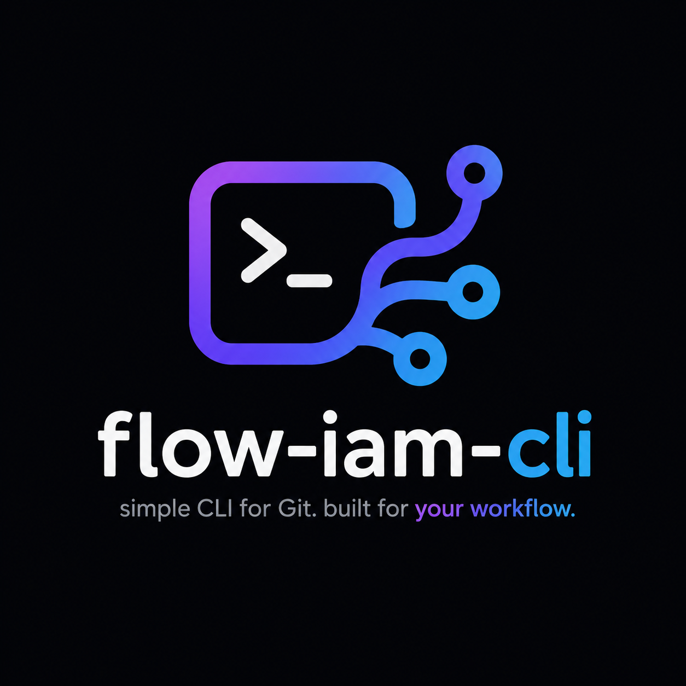

# flow-iam

The official CLI of flow-iam

# About

`flow-iam` is a custom CLI helper tool to simplify and standardize your Git branching workflow. It provides commands for creating sprints, features, hotfixes, fixes, commits, and PR/MR operations using either GitHub CLI (`gh`) or GitLab CLI (`glab`) or BitBucket CLI.

---

## 🚀 Features

- Initialize Git project
- Create sprint branches (take from master)
- Create feature branches (take from sprint)
- Create hotfix (take from master)
- create fix branches (take from anywhere except master)
- Commit with validation
- Create Pull Requests (PR) or Merge Requests (MR) (only for github or gitlab)
- Visualize commit history
- Interactive CLI mode
- push to remote
- sprint-finish & feature-finish for fast-forward without merge-request or pull request and automatically delete branch local and remote
- Installing Github/Gitlab/Bitbucket(on progress) platform

> [!note]
> This tool is designed to work with GitHub and GitLab. If you are using a different version of Git or a different version of the Git CLI, you may need to adjust the commands accordingly.

# How To install

```bash
npm install -g flow-iam-cli
```

# 📘 Example Workflows

Every command will be display prompt inputs when needed.

```bash
flow-iam # Choice mode
flow-iam init (-i) # Initialize Git project
flow-iam sprint (-s) # create srpint branch from master
flow-iam feature (-f) # create feature branch from spint branch
flow-iam hotfix (-hx) # Create hotfix branch from master by default
flow-iam fix # Create fix branch not from master
flow-iam commit (-c) # Input message (max 50 charactesrs)
flow-iam pr  #  Follow input prompts for PR creation
flow-iam push (-p) # push to remote
flow-iam log (-l) # Interactive log visualization
flow-iam sprint-finish (-sf) # finish sprint branch after merged into development/develop/master/staging, fast-forward to development without Pull request or merge request
flow-iam feature-finish (-ff) # finish feature branch after merged into sprint, fast-forward to sprint without Pull request or merge request
flow-iam install-plat-repo (-ins) # Install the platform CLI based on your operating system. Supported platforms: GitHub, GitLab, and Bitbucket.
flow-iam version (-v, --version) # show version.
flow-iam help (-h) #show help message

```
