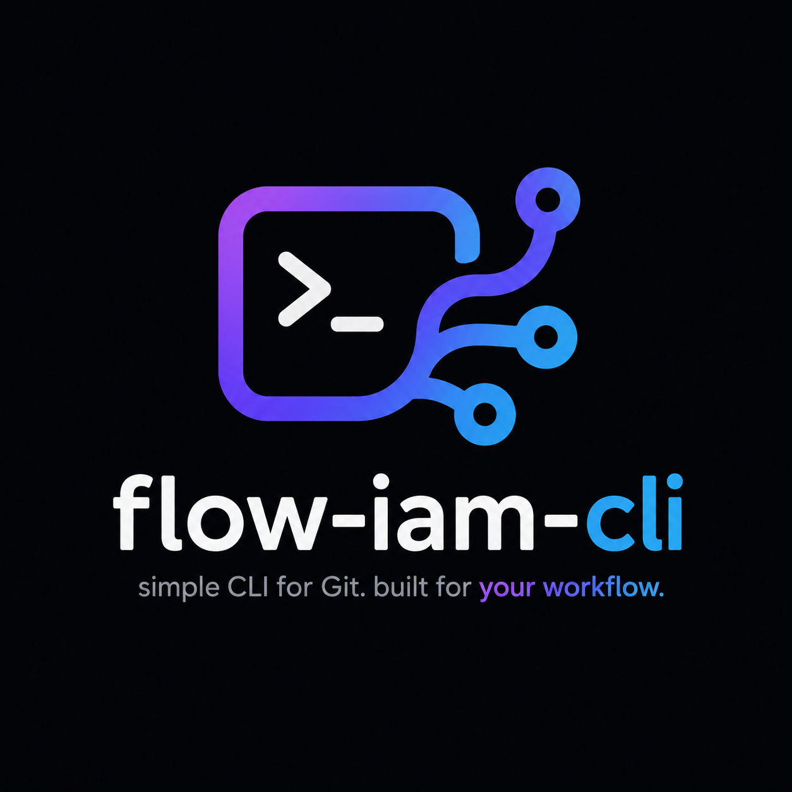

# flow-iam

> Modern, Highly Interactive Git Workflow & Branching Assistant CLI

## 📖 About

`flow-iam` is a powerful and intuitive Git workflow helper CLI designed to standardize team branching models (`sprint/*`, `feature/*`, `hotfix/*`, `fix/*`), streamline commit conventions, automate branch cleanup, and integrate seamlessly with GitHub / GitLab.

Powered by modern CLI libraries (`@clack/prompts`, `commander`, and `picocolors`), `flow-iam` delivers a delightful terminal experience with full keyboard navigation (arrow keys, enter, vim keys), live progress spinners, branch auto-discovery, and safety guards.

---

## 🚀 Key Features

- **Interactive Wizard Mode**: Run `flow-iam` without arguments to access an elegant interactive menu with arrow-key navigation.
- **Smart Branch Discovery**: Automatically detects existing `sprint/*` and `feature/*` branches in your repository so you don't have to memorize or type them manually.
- **Base Branch Auto-Detection**: Automatically detects whether your repo uses `main` or `master` as its primary branch.
- **Interactive Commit Wizard**:
  - Choose commit types with conventional icons (`✨ Feature`, `🐛 Fix`, `🏃 Sprint`, `🚑 Hotfix`, `🔀 Merge`, `📦 Release`, etc.).
  - Auto-stage untracked or modified files (`git add -A`).
  - Option to instantly push commit to remote with spinner feedback.
- **Safe Sprint & Feature Finishing**:
  - Automatic `--no-ff` merge into target branches (`develop`, `staging`, `main`, etc.).
  - Interactive confirmation to clean up local & remote branches.
- **PR & MR Integration**:
  - Interactive Pull Request (GitHub) & Merge Request (GitLab) creation via `gh` / `glab` CLI or browser fallback link.
- **Interactive Platform CLI Installer**:
  - Auto-detects your operating system (macOS, Ubuntu/Debian, Fedora/RHEL) and guides installation of `gh`, `glab`, or Bitbucket tools.
- **Async Git Spinners**: Visual progress spinners during network and Git operations (`pull`, `push`, `merge`, `checkout`).
- **Flexible Dual-Mode**: Works both interactively (`flow-iam`) and as a scriptable CLI with flags (`flow-iam sprint my-sprint`).

---

## 📦 Installation

Install globally via npm:

```bash
npm install -g flow-iam-cli
```

Or run directly using `npx`:

```bash
npx flow-iam-cli
```

---

## 📘 Usage & Workflows

### 1. Interactive Menu Mode (Recommended)

Simply run `flow-iam` in your Git repository to open the interactive dashboard:

```bash
flow-iam
```

Navigate using `↑` / `↓` arrow keys and press `Enter` to select an action.

---

### 2. Direct Command Mode

You can also run commands directly with optional flags and arguments:

| Command                            | Shorthand         | Description                                                     |
| :--------------------------------- | :---------------- | :-------------------------------------------------------------- |
| `flow-iam`                         |                   | Buka Interactive Wizard Menu                                    |
| `flow-iam init`                    | `-i`              | Inisialisasi Git repository                                     |
| `flow-iam sprint [name]`           | `-s`              | Buat branch `sprint/*` dari default branch (`main`/`master`)    |
| `flow-iam feature [name]`          | `-f`              | Buat branch `feature/*` dari branch sprint (auto-detect sprint) |
| `flow-iam hotfix [name]`           | `-hx`             | Buat branch `hotfix/*` dari default branch                      |
| `flow-iam fix [name]`              |                   | Buat branch `fix/*` dari branch selain master/main              |
| `flow-iam commit`                  | `-c`              | Jalankan Commit Wizard interaktif                               |
| `flow-iam push`                    | `-p`              | Push branch aktif secara aman ke remote dengan upstream setup   |
| `flow-iam sprint-finish [target]`  | `-sf`             | Merge sprint ke develop/staging/main & bersihkan branch         |
| `flow-iam feature-finish [target]` | `-ff`             | Merge feature ke sprint & bersihkan branch                      |
| `flow-iam pr`                      | `mr`              | Buat Pull Request (GitHub) atau Merge Request (GitLab)          |
| `flow-iam log`                     | `-l`              | Visualisasi grafik riwayat commit Git                           |
| `flow-iam remote`                  | `-r`              | Tampilkan URL remote repository saat ini                        |
| `flow-iam install-plat-repo`       | `-ins`            | Panduan instalasi GitHub / GitLab / Bitbucket CLI               |
| `flow-iam version`                 | `-v`, `--version` | Tampilkan versi `flow-iam`                                      |
| `flow-iam help`                    | `-h`, `--help`    | Tampilkan bantuan perintah                                      |

---

## 🧪 Development & Testing

```bash
# Clone repository
git clone https://github.com/ilhamnoerr95/flow-iam-cli.git
cd flow-iam-cli

# Install dependencies
npm install

# Run tests
npm test

# Test CLI locally
node ./bin/flow-iam
```

---

## 📄 License

MIT © [Ilhamnrachman](https://github.com/ilhamnoerr95)
